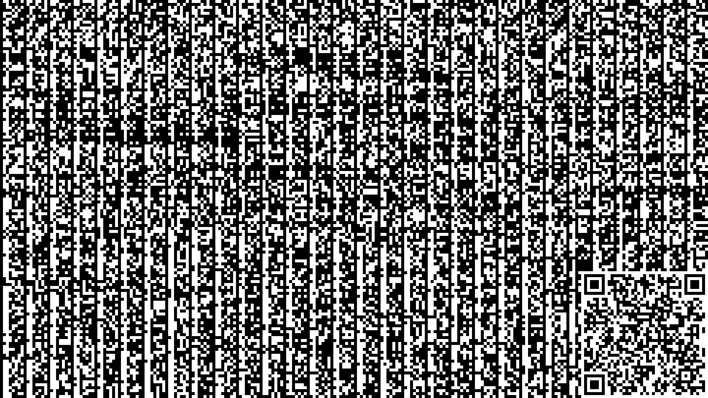

# Snow Crash Generator
## About the Repository
This is a small art project.
A tribute to the awesome science fiction novel 'Snow Crash' by Neal Stephenson.
It was first published in 1992. Today it is  retro, modern and futuristic at once.

This repository consists of a python program that generates an image from the binary data of text files.
As an example the source code of the program itself and this text file are used to create the following image:



It also includes a QR code with the URL of this repository.

## About the Book
In the book, Neal Stephenson describes the concept and term 'Metaverse' for the first time.
I also found the ideas and thoughts about the spreading of information very interesting.
Very fittingly I am now spreading the word about the book in this repository.

### Snow Crash
The term 'Snow Crash' describes the static seen on an old TV or PC that is broken or has crashed.
However, such a static can also be interpreted as a bitmap representing information.
To not spoil the plot of the book, I won't go into more detail here.

## Program Usage
### Prerequisites
Python and PIP need to be available to run this program.

### Installing the Dependencies
Before running the program install the required python modules `Pillow` and `qrcode`:
```commandline
pip install Pillow qrcode
```

### Adjusting the Generated Image
One can adjust the variables at the top of the python program [snow-crash-generator.py](snow-crash-generator.py) to adjust the generated image.
It is possible to adjust the following properties:
- The image resolution in pixels
- The granularity of the data in pixels
- The background color
- The filename of the generated image
- The filenames of the text files that will be turned into the image
- Include a QR code or not
- The content of the QR code

### Generating an Image
To generate an image run:
```commandline
python snow-crash-generator.py
```
_Note: This will override a previously generated image._

### QR Code
The book describes that a bitmap could be used to spread information.
This is well known to us today in the form of QR codes.
So I included an optional QR code in the bottom right corner.
I made it optional because theoretically it overwrites the data at its location.

## Fitting Ambient Music
You might want to check out this fitting Spotify playlist: [Cyberpunk Audio Firmware 1.0](https://open.spotify.com/playlist/7H4qgurXOI3ISYtDZ61IsK)
